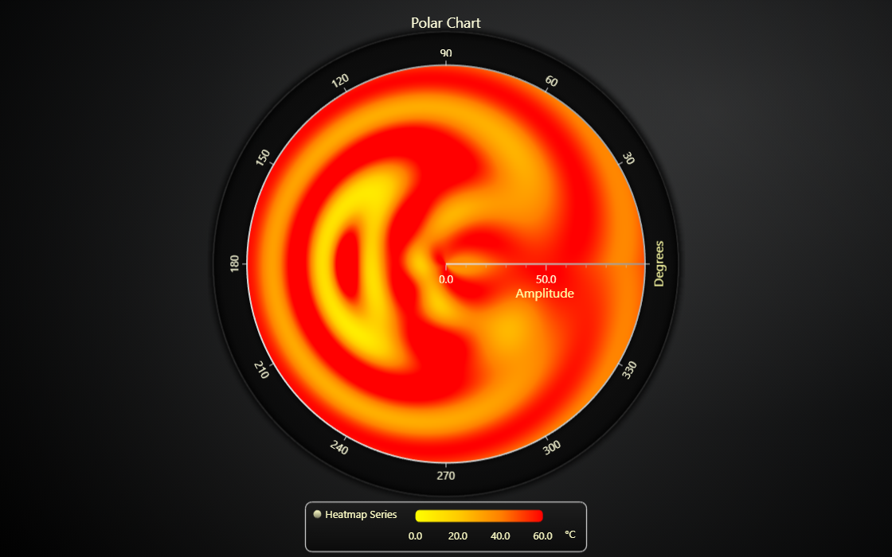

# JavaScript Polar Heatmap Chart

This demo application belongs to the set of examples for LightningChart JS, data visualization library for JavaScript.

LightningChart JS is entirely GPU accelerated and performance optimized charting library for presenting massive amounts of data. It offers an easy way of creating sophisticated and interactive charts and adding them to your website or web application.

The demo can be used as an example or a seed project. Local execution requires the following steps:

-   Make sure that relevant version of [Node.js](https://nodejs.org/en/download/) is installed
-   Open the project folder in a terminal:

          npm install              # fetches dependencies
          npm start                # builds an application and starts the development server

-   The application is available at _http://localhost:8080_ in your browser, webpack-dev-server provides hot reload functionality.

## Description

Example on the basics of Polar Heatmap feature.

The Polar Heatmap allows visualizing a 2D matrix of numeric data in a polar coordinate system.
The data is layed out in a grid split to _sectors_ (angle axis) and _annuli_ (amplitude axis).

The most important built-in features are:

-   Fast data and color updates.
-   Bilinear interpolation to smoothly color pixels between data values.

To learn how to extrapolate a heatmap data matrix from a scattered data set, see [Polar Sensor Heatmap example](https://lightningchart.com/lightningchart-js-interactive-examples/examples/lcjs-example-1005-polarHeatmapSensors.html)

## API Links

* [Polar chart]
* [Polar heatmap series]
* [Polar radial axis]
* [Polar amplitude axis]

## Support

If you notice an error in the example code, please open an issue on [GitHub][0] repository of the entire example.

Official [API documentation][1] can be found on [LightningChart][2] website.

If the docs and other materials do not solve your problem as well as implementation help is needed, ask on [StackOverflow][3] (tagged lightningchart).

If you think you found a bug in the LightningChart JavaScript library, please contact support@lightningchart.com.

Direct developer email support can be purchased through a [Support Plan][4] or by contacting sales@lightningchart.com.

[0]: https://github.com/Arction/
[1]: https://lightningchart.com/lightningchart-js-api-documentation/
[2]: https://lightningchart.com
[3]: https://stackoverflow.com/questions/tagged/lightningchart
[4]: https://lightningchart.com/support-services/

© LightningChart Ltd 2009-2022. All rights reserved.

[Polar chart]: https://lightningchart.com/js-charts/api-documentation/v4.2.0/classes/PolarChart.html
[Polar heatmap series]: https://lightningchart.com/js-charts/api-documentation/v4.2.0/
[Polar radial axis]: https://lightningchart.com/js-charts/api-documentation/v4.2.0/interfaces/PolarAxisRadial.html
[Polar amplitude axis]: https://lightningchart.com/js-charts/api-documentation/v4.2.0/classes/PolarAxisAmplitude.html

